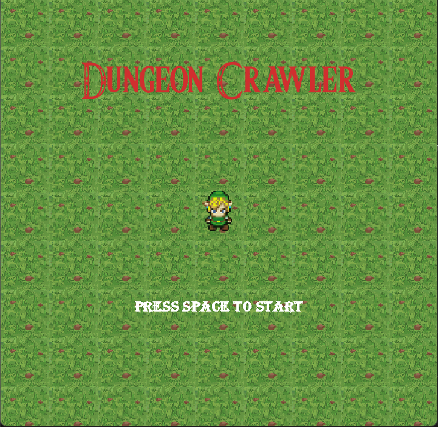
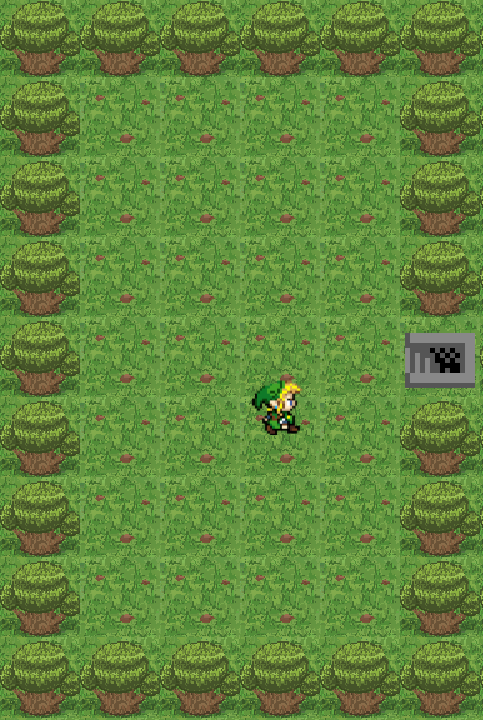
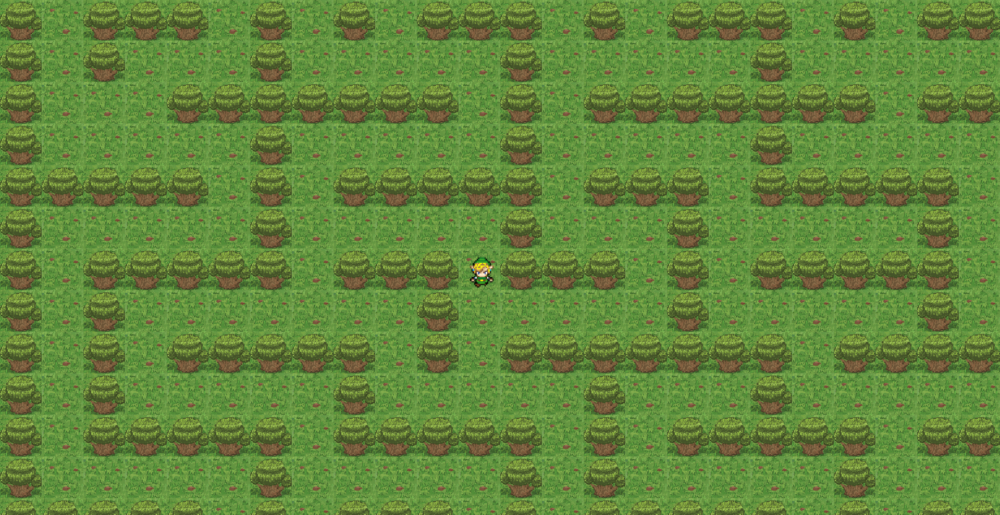

# Java Simple Game

## Overview
The project is the final result of the course *Object Oriented Programming in Java* at ENSEA university.  
The aim of this project is to code a simple game.

Implemented features:
* Title screen;
* Levels;
* Ability to run;
* Camera.

## How to compile
Clone the project:
``` bash
git clone https://github.com/william-nicolussi/java-exercise
```
To compile the code:
``` bash
make
```
To run the game:
``` bash
make exec
```

## Screenshots
<p align="center">
 
</p>
<p align="center">
 
</p>
<p align="center">
 
</p>

## Author
William Nicolussi Zom